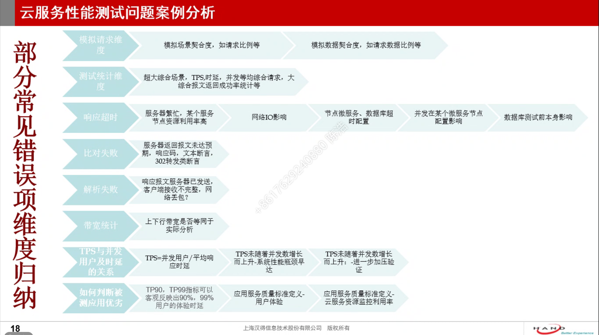
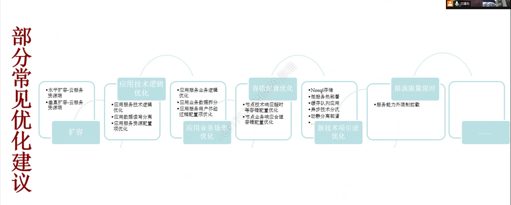

# 云服务端性能测试报告分析

## 云服务性能测试应用场景

1. 理解场景?

## 云服务协议性能测试

- http/https 模拟并发、监控、分析、服务治理
- websocket
- udp
- tcp
- rpc
- 其他或自定义网络协议

## 云服务全链路性能测试指标项

- 客户端请求
  - 客户端设备：分布式请求/客户端设备模拟并发（ip/sn）
  - 工具：异同工具数据统计
  - 响应时间：90%响应时间、平均响应时间、最大响应时间
  - tps/qps/hps：每秒处理事务数/请求数/点击率
  - 吞吐量：网络吞吐
  - 思考时间：业务场景中请求间隔思考时间
  - 并发数/并发用户数：并发请求数、并发用户数
  - 成功率：
- 服务器
  - 负载均衡服务器：CPU/IO（硬盘、网络）/内存
  - 单元应用服务器
  - 单元数据库服务器
  - 单元微服务实例
  - 多链路服务器配置比例：并发请求多链路单元应用服务分发配置比例
- 周边链路
  - 单元网络带宽：理论网络带宽、真实带宽、流媒体真是带宽
  - 类saas服务：服务能力分配

## 云服务性能测试报告相关图表

- zabbix监控
- jmeter压测报告图表
- loadrunner

## 云服务性能测试多维度统计

- 最小服务单元处理能力统计数据量/单位时间
- 统计并发数据量/单位带宽等单位条件
- 读写日志文件等处理能力统计分析
- 异步队列线程资源释放统计分析
- 多链路微服务资源统计分析
- 分布式部署资源统计分析
- 异同容错统计分析

## 云服务性能测试问题案例分析

